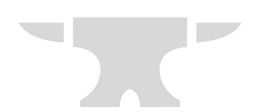

  
  <h1>Forge the Future: PixelForge Studios</h1>
  
<i>"Transformando o mundo real em uma interface digital cheia de camadas."</i>

  

    
    
    
  

---

## 🚀 Sobre o Projeto

A **PixelForge Studios** é uma landing page de alto impacto desenvolvida para apresentar soluções em Realidade Aumentada (AR). O projeto foca em uma experiência de usuário (UX) imersiva, utilizando navegação horizontal e efeitos visuais inspirados na estética futurista.

> [!IMPORTANT]
> **AVISO DE EMPRESA FICTÍCIA:** A PixelForge Studios é uma empresa puramente fictícia criada para fins acadêmicos. Este projeto faz parte do desenvolvimento do curso de Análise e Desenvolvimento de Sistemas.

---

## 🛠️ Tech Stack

  
  
  

---

## ✨ Features Brabíssimas

- 🌀 **Navegação Circular Infinita:** Um sistema de scroll inteligente que nunca deixa o usuário no "fim da linha", conectando a última seção de volta à Home.
- ⚡ **Glow & Neon UX:** Estilização avançada com filtros de desfoque e sombras dinâmicas que garantem nitidez mesmo em fundos vibrantes.
- 📐 **Layout Zigue-Zague:** Mostruário de produtos alternado para uma leitura dinâmica e profissional.
- 📍 **Status Ativo em Tempo Real:** O menu superior acende em azul neon automaticamente conforme você navega pelas telas.
- 🎯 **Navegação Lateral Oculta:** Áreas de clique de 40px nas extremidades que se revelam ao passar o mouse, mantendo o design limpo.

---

## 📂 Estrutura do Site

- **Home:** O portal de entrada com tipografia pixelada e foco na identidade visual.
- **Sobre:** A visão institucional e o propósito da empresa para o futuro.
- **Experiências:** Catálogo visual e tabela técnica de preços/serviços.
- **Contato:** Formulário responsivo e higienizado para captação de novos projetos.

---

## ⚙️ Como rodar o projeto

1. Faça o clone do repositório.
2. Certifique-se de que a pasta `assets` está no mesmo diretório do `index.html`.
3. Abra o arquivo `index.html` em qualquer navegador moderno.
4. **Dica:** Use o scroll do mouse ou as setas laterais para navegar.

---

## 👨‍💻 Desenvolvedor

<table align="center">
  <tr>
    <td align="center">
      <a href="https://github.com/SeuUsuario">
         
        <b>Gil Alberice</b>
      </a>
    </td>
  </tr>
</table>

  
Feito com ☕ e muito neon por <b>Gil Alberice</b>.

